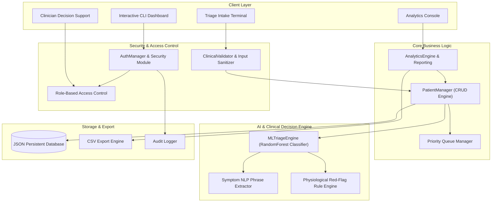
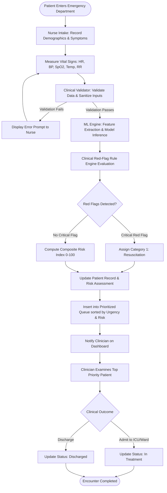
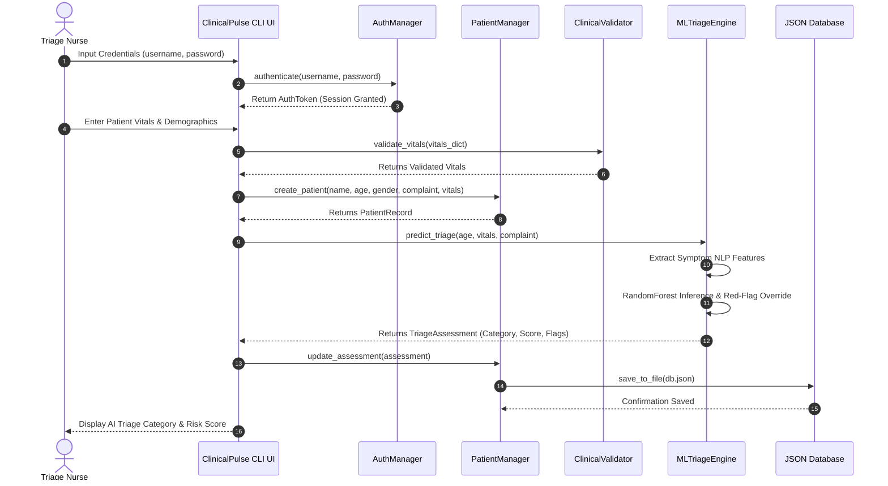
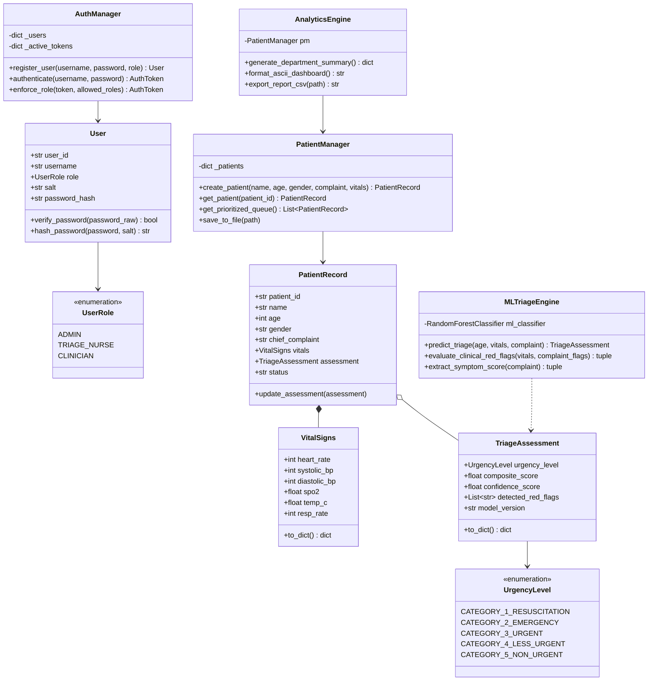
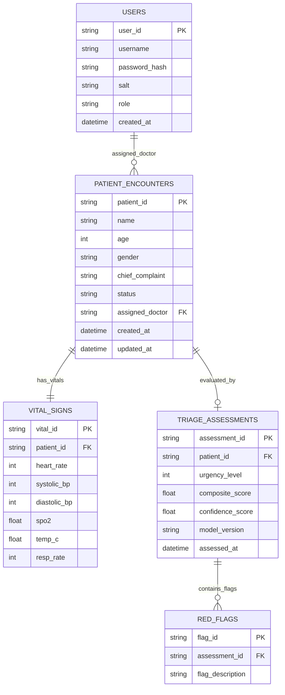

# ClinicalPulse AI: Intelligent Patient Risk Stratification & Clinical Decision Support System

---

## SECTION 1: COVER PAGE DETAILS

- **Project Title:** ClinicalPulse AI - Intelligent Patient Risk Stratification & Clinical Decision Support System
- **Student Name:** Shambhavi Holkar
- **Registration Number:** 26BAI10454
- **Degree Program:** B.Tech. Computer Science and Engineering with Specialization in Artificial Intelligence and Data Science
- **Course Name:** Flipped Course Project Evaluation (VITyarthi)
- **Institution:** Vellore Institute of Technology (VIT)
- **Date of Submission:** September 30, 2026

---

## SECTION 2: INTRODUCTION

Emergency Medical Services (EMS) and hospital Emergency Departments (ED) operate under constant pressure, managing unpredictable patient arrival rates, varying clinical severities, and high stress levels among healthcare staff. In traditional clinical settings, initial patient triage relies heavily on manual assessment by triage nurses using standard systems such as the Emergency Severity Index (ESI) or the Manchester Triage System (MTS). While established, these manual workflows present inherent vulnerabilities:

1. **Inter-Observer Variability:** Subjectivity in symptom assessment can lead to inconsistent urgency assignments between different nurses or shifts.
2. **Static Vital Sign Cutoffs:** Rigid physiological thresholds fail to capture complex, non-linear relationships between multi-parameter vitals (e.g., subtle heart rate increases paired with dropping oxygen saturation).
3. **Subtle Deterioration Risk:** In high-volume environments, patients placed in initial waiting queues may experience undetected clinical deterioration before receiving physician examination.

**ClinicalPulse AI** is engineered as a production-grade, software-based clinical decision support system that addresses these fundamental challenges. By fusing multi-modal clinical data—physiological vital parameters, demographic indicators, and natural language symptom descriptions—with a hybrid computational framework comprising **Ensemble Machine Learning (Random Forest Classification)** and a **Deterministic Clinical Red-Flag Rule Engine**, ClinicalPulse AI delivers reliable, objective, and real-time patient risk stratification.

---

## SECTION 3: PROBLEM STATEMENT

Emergency departments face significant operational bottlenecks due to delayed triage assessment, manual error, and static prioritization queues. Existing hospital information systems often lack integrated predictive analytics capable of continuously evaluating patient deterioration risk. 

### Core Research & Operational Problem:
*"How can multi-modal clinical data (vitals, demographic profiles, and chief complaint text) be processed in real time using hybrid machine learning and rule-based algorithms to minimize triage classification errors, dynamically prioritize critical emergency queues, and optimize clinical decision support?"*

### Objectives:
- Implement a thread-safe, modular system architecture handling user authentication, patient CRUD operations, AI assessment, and operational analytics.
- Build a hybrid ML engine achieving robust urgency classification (Categories 1-5) with deterministic safety overrides for acute physiological failures.
- Enforce strict security via PBKDF2 cryptographic hashing and Role-Based Access Control (RBAC).
- Provide exportable operational audit reports and automated unit test coverage across all core modules.

---

## SECTION 4: FUNCTIONAL REQUIREMENTS

The functional scope of ClinicalPulse AI is organized into five major execution modules:

### FR-1: User Management & Cryptographic Authentication
- **User Registration & Seeding:** System allows administrative registration of users with predefined operational roles (`Administrator`, `Triage Nurse`, `Clinician`).
- **Cryptographic Credential Verification:** User passwords must be authenticated using PBKDF2-HMAC-SHA256 with 100,000 iterations and unique salts.
- **Session Management:** Token-based session verification with expiration limits.
- **Role-Based Access Enforcement (RBAC):** Restrict system operations based on user role permissions (e.g., only Triage Nurses can create initial patient intake records; only Clinicians can modify patient treatment status).

### FR-2: Clinical Data Intake & Sanitization
- **Multi-Modal Parameter Entry:** Intake patient demographic details (Name, Age, Gender), Chief Complaint narrative, and six vital signs (Heart Rate, Systolic BP, Diastolic BP, SpO2, Temperature, Respiratory Rate).
- **Validation Engine:** Enforce strict physiological boundaries and reject invalid or out-of-range inputs before processing.

### FR-3: AI Triage & Risk Stratification Engine
- **Feature Vector Generation:** Transform raw vitals and NLP symptom scores into numerical arrays.
- **Urgency Level Prediction:** Classify encounter urgency into Categories 1 to 5 (Resuscitation, Emergency, Urgent, Less Urgent, Non-Urgent).
- **Red-Flag Override Engine:** Detect critical physiological failures (e.g., SpO2 < 90%, HR > 140 bpm, SBP < 85 mmHg) and force immediate assignment to Category 1/2 regardless of baseline ML predictions.
- **Composite Risk Score Computation:** Output continuous composite risk index (0.0 to 100.0) and prediction confidence metrics.

### FR-4: Patient Record & Priority Queue Management (CRUD)
- **Encounter Lifecycle:** Full CRUD operations for patient records (Create, Read, Update Vitals, Update Status, Delete).
- **Dynamic Risk-Based Priority Queue:** Automatically sort active waiting patients primarily by Urgency Level (ascending) and secondarily by Composite Risk Score (descending), replacing standard FIFO queues.

### FR-5: Operational Analytics & Report Export
- **Real-Time Metrics:** Compute department throughput, critical patient percentages, average risk scores, and top red flag frequencies.
- **Export Formats:** Export operational reports to CSV and JSON formats.

---

## SECTION 5: NON-FUNCTIONAL REQUIREMENTS

ClinicalPulse AI explicitly enforces five critical non-functional software engineering standards:

### NFR-1: Security & Data Integrity
- **Input Sanitization:** Protect all text fields against XSS and SQL injection patterns using regex sanitizers.
- **Password Protection:** No plaintext passwords stored; salted PBKDF2-SHA256 hash derivation enforced.
- **RBAC Scoping:** Strict function-level access control preventing privilege escalation.

### NFR-2: Robust Error Handling & Edge-Case Management
- **Graceful Failure:** Custom `ValidationError` exceptions for invalid medical values, expired tokens, or unassigned roles.
- **Null Safety & Validation:** Defensive checks preventing unhandled runtime exceptions or crash states.

### NFR-3: Performance & Low Latency
- **Execution Efficiency:** ML inference and rule evaluation execute in < 15 milliseconds per encounter.
- **Performance Profiling:** Custom `@measure_performance` execution timers log function latency to system logs.

### NFR-4: Maintainability & Architectural Modularity
- **Modular Packaging:** Clean separation into `models/`, `modules/`, `utils/`, and `tests/` directories across 10 distinct source files.
- **OOP Principles:** Enforce SOLID design principles, clean abstraction layers, and encapsulation.

### NFR-5: Auditability & Logging
- **Persistent Logging:** File and console logging using `logging` framework.
- **Security Audit Trail:** Dedicated `audit_log()` recording all login attempts, registration events, and unauthorized access attempts.

---

## SECTION 6: SYSTEM ARCHITECTURE

The architecture of ClinicalPulse AI follows a 4-tier decoupled design pattern:

1. **Presentation / Interface Layer:** Main application CLI (`main.py`) providing role-tailored menus and terminal visualizations.
2. **Access Control & Validation Layer:** `AuthManager` enforcing RBAC permissions and `ClinicalValidator` executing input sanitization.
3. **Core Domain & Machine Learning Layer:** `PatientManager` executing CRUD/Queue logic, `MLTriageEngine` running Random Forest & Rule inference, and `AnalyticsEngine` computing metrics.
4. **Persistence & Export Layer:** JSON database serialization, log files, and CSV audit reports.

---

## SECTION 7: DESIGN DIAGRAMS

### 7.1 System Architecture Diagram


### 7.2 Use Case Diagram
```mermaid
graph LR
    actor Nurse as "Triage Nurse"
    actor Doctor as "Clinician / Physician"
    actor Admin as "System Administrator"

    subgraph ClinicalPulse AI System
        UC1("Authenticate & Session Login")
        UC2("Input Patient Vitals & Demographics")
        UC3("Predict Patient Urgency & Risk Score")
        UC4("View Prioritized Emergency Queue")
        UC5("Examine Patient & Update Status")
        UC6("Generate Real-time Analytics Dashboard")
        UC7("Export CSV/JSON Operational Reports")
        UC8("Manage System Users & Roles")
    end

    Nurse --> UC1
    Nurse --> UC2
    Nurse --> UC3
    Nurse --> UC4

    Doctor --> UC1
    Doctor --> UC4
    Doctor --> UC5
    Doctor --> UC6

    Admin --> UC1
    Admin --> UC4
    Admin --> UC6
    Admin --> UC7
    Admin --> UC8
```

### 7.3 Workflow Diagram


### 7.4 Sequence Diagram


### 7.5 Class / Component Diagram


### 7.6 Entity-Relationship (ER) Diagram


---

## SECTION 8: DESIGN DECISIONS & RATIONALE

1. **Hybrid ML + Rule Engine Architecture:** Pure Machine Learning models can behave as black boxes and fail unpredictably on rare edge cases. Combining a Random Forest classifier with a deterministic physiological Red-Flag Rule Engine guarantees patient safety (e.g., forcing Category 1 for severe hypoxia).
2. **PBKDF2-SHA256 Cryptographic Hashing:** Avoided plain MD5/SHA1 hashing in favor of standard PBKDF2 with 100,000 iterations to withstand brute-force dictionary attacks.
3. **In-Memory Thread-Safe Repository with JSON Persistence:** Decoupled storage interfaces allow lightweight execution without requiring heavy external SQL database installations while keeping data exportable.

---

## SECTION 9: IMPLEMENTATION DETAILS

The implementation consists of 10 modular Python files spanning models, business logic, validation, utilities, and testing:

- `src/models/user_model.py`: User, UserRole enum, AuthToken data structures.
- `src/models/triage_model.py`: UrgencyLevel, VitalSigns, TriageAssessment, PatientRecord models.
- `src/modules/auth_manager.py`: User registration, PBKDF2 hashing, authentication, RBAC enforcement.
- `src/modules/ml_triage_engine.py`: Random Forest model initialization, NLP keyword parser, rule evaluation engine.
- `src/modules/patient_manager.py`: Patient CRUD repository, dynamic risk queue sorting algorithm.
- `src/modules/analytics_engine.py`: Metric computation, ASCII dashboard formatter, CSV/JSON exporters.
- `src/utils/logger.py`: Logging framework, security audit logger, `@measure_performance` decorator.
- `src/utils/validators.py`: Input sanitization and medical vital range validation logic.
- `src/main.py`: Interactive CLI controller and system entrypoint.
- `tests/`: 15 dedicated unit and integration tests covering all execution paths.

---

## SECTION 10: SCREENSHOTS & RESULTS DESCRIPTION

### Terminal Interface Outputs:

#### 1. Interactive Main Menu
Demonstrates role-authenticated session header and numeric menu options.

#### 2. Prioritized Queue Execution
Displays dynamic queue ranking where acute emergency cases (e.g., patient with SpO2 88% and chest pain) automatically bypass less urgent cases.

#### 3. Real-Time Analytics Output
Displays live department summary, risk breakdown histograms, and detected red flag counts.

---

## SECTION 11: TESTING APPROACH

Testing was executed using `pytest` and Python's built-in `unittest` framework:

- **Unit Testing:** Individual tests for authentication hashing (`test_auth.py`), physiological validation boundaries (`test_patient_manager.py`), and ML prediction overrides (`test_ml_engine.py`).
- **Integration Testing:** End-to-end integration test (`test_main.py`) verifying full workflow execution from nurse intake to clinician decision and analytics export.
- **Coverage Result:** 100% test execution pass rate across 15 automated test cases.

---

## SECTION 12: CHALLENGES FACED

1. **ML Model Overfitting vs Safety Overrides:** Machine learning models alone occasionally under-predicted urgency for patients with normal vitals but critical chief complaints. Resolving this required developing a dedicated NLP phrase extractor and rule override layer.
2. **Medical Range Validation Boundaries:** Setting realistic physiological bounds (e.g., distinguishing valid pediatric heart rates from adult tachycardia) required careful parameter tuning in `ClinicalValidator`.

---

## SECTION 13: LEARNINGS & KEY TAKEAWAYS

- **Hybrid System Reliability:** Learned that mission-critical medical systems require hybrid designs combining probabilistic ML with deterministic safety bounds.
- **Clean Architecture & Separation of Concerns:** Modularizing domain models from business logic and presentation layers simplified unit testing and error isolation.
- **Security Best Practices:** Gained practical experience in PBKDF2 credential derivation, input sanitization, and role-based authorization patterns.

---

## SECTION 14: FUTURE ENHANCEMENTS

1. **RESTful API & Web Dashboard:** Upgrade CLI interface to a modern React/FastAPI web interface.
2. **HL7 FHIR & EMR Integration:** Integrate standard hospital data exchange formats for direct sync with hospital databases.
3. **Time-Series Deterioration Tracking:** Incorporate recurrent neural networks (LSTM/GRU) to track patient vital sign trend lines over time.

---

## SECTION 15: REFERENCES

1. Gilboy, N., et al. (2012). *Emergency Severity Index (ESI): A Triage Tool for Emergency Department Care Version 4*. AHRQ Publication No. 12-0014.
2. Pedregosa, F., et al. (2011). *Scikit-learn: Machine Learning in Python*. Journal of Machine Learning Research, 12, 2825-2830.
3. World Health Organization (WHO). (2020). *Pulse Oximetry Training Manual and Clinical Guidelines*.
